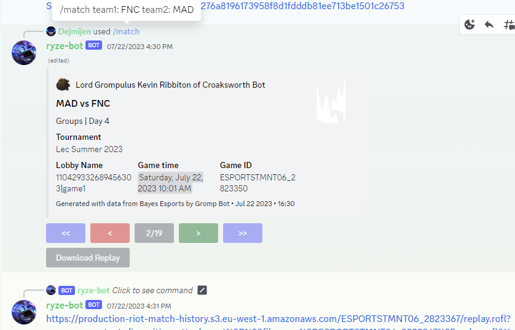

# Gromp Bot

Gromp Bot is a specialized Discord bot designed to deliver League of Legends Esports replays directly to coaches and players. Leveraging the Bayes Esports API, the bot offers a user-friendly interface to search, filter, and download match replays right in discord.

With esports data being moved onto GRID and the author joining a team, this project will no longer receive updates.
---

---

## Features

- **Search Replays**: Filter by game type, team name, and tags.
- **Download Replays**: Direct download links for replays.
- **User-Friendly**: Designed for coaches and players to use with minimal setup.
- **Highly Configurable**: Limit bot to specific Discord guilds.

---

## Prerequisites

- Python 3.10 or higher
- Docker (Optional for deployment)

---

#### Clone the project

```bash
git clone https://github.com/Allan-Cao/Gromp-Bot.git
```

---

#### (Optional) Create a virtual environment

- **Linux/MacOS**

  ```bash
  python3 -m venv bot-env
  source bot-env/bin/activate
  ```

- **Windows**

  ```bash
  py -m venv bot-env
  bot-env\Scripts\activate
  ```

---

#### Install dependencies

```bash
pip install -r requirements.txt
```


---

#### Environment Variables

You'll need to set the environment variables. You can do this by renaming .env.example to a file called .env in the root directory of the project and modifying the variables in the file or if you are deploying with docker, consider passing in env variables with the `--env-file` option.

`GUILDS_ALLOWED` specifies which servers the bot is allowed to take commands from which should be a string that has comma-seperated server-IDs.

> **Note**: To find your server ID, follow [this guide](https://support.discord.com/hc/en-us/articles/206346498-Where-can-I-find-my-User-Server-Message-ID-).

---

#### Start the bot

```bash
python bot.py
```

---

## Building and Deploying with Docker

1. **Install Docker**: [Official Website](https://www.docker.com/get-started)
2. **Clone Repository**: `git clone https://github.com/Allan-Cao/Gromp-Bot.git`
3. **Navigate to Directory**: `cd Gromp-Bot`
4. **Build Image**: `docker build -t gromp-bot .`
5. **Run Container**: `docker run -d gromp-bot`
6. **Verify Container**: `docker ps`

**Stop Container**: `docker stop <container-id>`

---

## Usage

- **Search Matches**: `/match`
- **Download Replay**: `/download <game_id>`

---

## License

This project is licensed under the [MIT](https://choosealicense.com/licenses/mit/) License. See the LICENSE file for more information.
